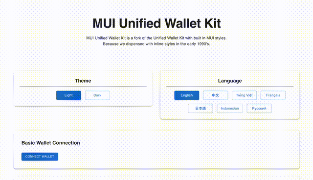

# Unified Wallet Kit MUI



Unified Wallet Kit MUI is a Material UI (v6) implementation of `@jup-ag/wallet-adapter` with MUI styles over tailwind.

NPM: https://www.npmjs.com/package/@harkl/unified-wallet-adapter-mui

## Motives

- `@jup-ag/wallet-adapter` provides a great user experience 
- not everyone loves tailwind
- [legendsofsol.com](https://legendsofsol.com) uses MUI under the hood and needed a good wallet adapter

## Core features

- [x] Fully integrated with Material UI v6 components
- [x] Built-in Wallet Standard, Mobile Wallet Adapter support
- [x] Abstracted wallet adapter, with a BYOW (Bring your own wallets) approach
- [x] Mobile responsive design
- [x] MUI core notification system integration
- [x] Internationalization (i18n) with translation support
- [x] Theming - Light and Dark modes using native MUI theming

## Getting Started

- `npm i @harkl/unified-wallet-adapter-mui`
- Wrap your app with `<UnifiedWalletProvider />` and pass in as little to as many wallets you would like to support.
- Below example is `ExampleBaseOnly.tsx`

```tsx
const ExampleBaseOnly = () => {
  return (
    <UnifiedWalletProvider
      wallets={[]}
      theme={<your-mui-theme>}
      config={{
        autoConnect: false,
        env: 'mainnet-beta',
        metadata: {
          name: 'UnifiedWallet',
          description: 'UnifiedWallet',
          url: 'https://jup.ag',
          iconUrls: ['https://jup.ag/favicon.ico'],
        },
        notificationCallback: WalletNotification,
        walletlistExplanation: {
          href: 'https://station.jup.ag/docs/additional-topics/wallet-list',
        },
      }}
    >
      <UnifiedWalletButton />
    </UnifiedWalletProvider>
  );
};

export default ExampleBaseOnly;
```

## Material UI Integration

This package is built with Material UI v6 components to seamlessly integrate with your Material UI applications. All components use the MUI styling system and theme provider for consistent styling across your application.

## Components

- `UnifiedWalletProvider` - Main context provider that manages wallet state
- `UnifiedWalletButton` - Button component to connect/disconnect wallet
- `CurrentUserBadge` - Display currently connected wallet with address
- `PreviewFunctionality` - Component to preview wallet functionality

## More features

All other features and philosophies are inline with the parent repo at `@jup-ag/wallet-adapter`.

## Support

Support @harkl by getting an upgradable Legends of SOL NFT with its own custom traits at [Tensor](https://www.tensor.trade/trade/legends_of_sol) or buying some [$LEGEND](https://app.meteora.ag/pools/wGE6ab1eDxT2pJenpLkF8SkHLxkqMP2rgdnviZnoQCN). All Legends NFTs can be customised at [legendsofsol.com](https://legendsofsol.com).

